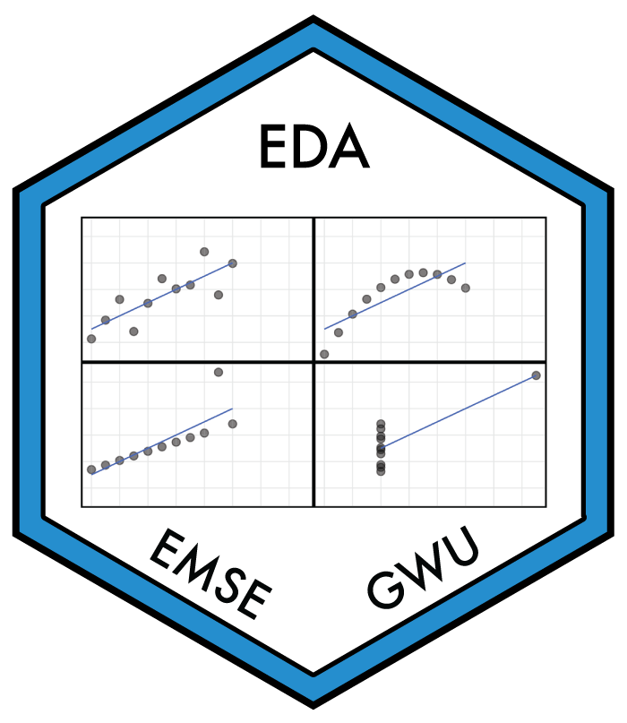

<!-- README.md is generated from README.Rmd. Please edit that file -->

```{r, include = FALSE}
knitr::opts_chunk$set(
  collapse = TRUE,
  warning = FALSE,
  message = FALSE,
  comment = "#>",
  fig.path = "man/figures/README-",
  fig.retina = 3
)
```

# edata <a href='https://jhelvy.github.io/edata/'></a>

This package contains datasets used in the GWU course [Exploratory Data Analysis](http://eda.seas.gwu.edu/).

## Installation

The current version is not yet on CRAN, but you can install it from
Github using the {remotes} library:

```{r, eval=FALSE}
# install.packages("remotes")
remotes::install_github("jhelvy/edata")
```

Load the library with:

```{r}
library("edata")
```

## Usage

Once loaded, you can work with any of the data sets available in the package. You can find out more about each data set using `?`, e.g., `?df`.

## Author, Version, and License Information

- Author: *John Paul Helveston* https://www.jhelvy.com/
- Date First Written: *Friday August 11, 2023*
- License: [MIT](https://github.com/jhelvy/edata/blob/master/LICENSE.md)

## Citation Information

If you use this package for in a publication, I would greatly appreciate it if you cited it - you can get the citation by typing `citation("edata")` into R:

```{r}
citation("edata")
```
